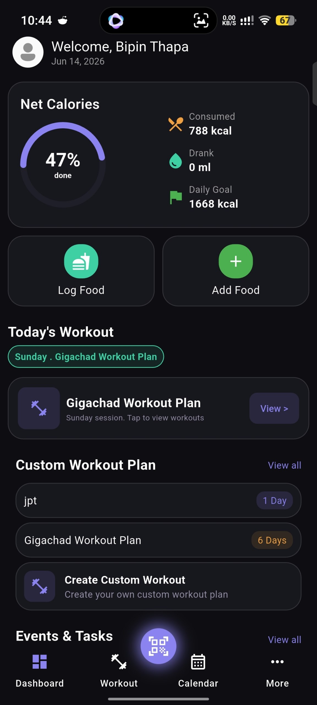
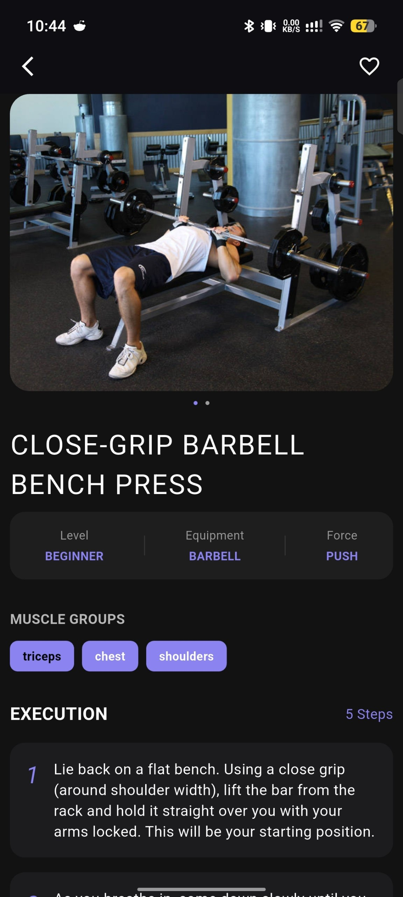
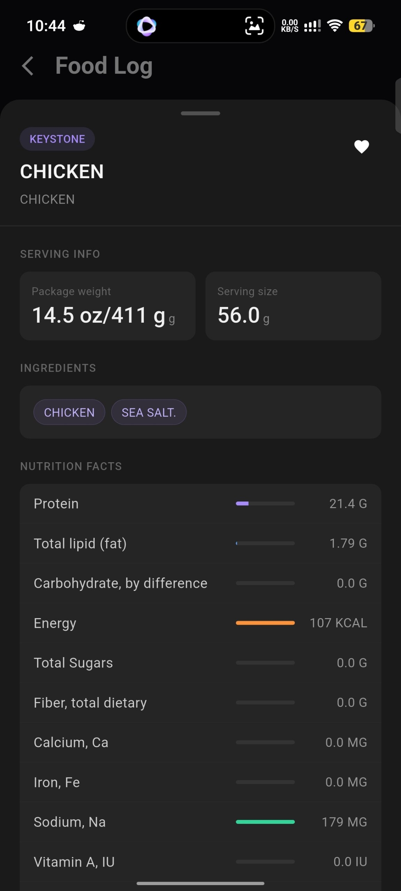

# Arise

Arise is a powerful and simple **all-in-one fitness tracking application** designed to help users take control of their health, workouts, nutrition, and daily schedule.

This app combines **calorie tracking, custom workout planning, and event/task scheduling** into a single seamless experience.

---

## Features

### Calorie & Nutrition Tracking
- Track daily food intake easily
- Maintain a daily nutrition log
- Helps users stay within fitness goals (weight loss, gain, or maintenance)

---

### Custom Workout Planner
- Create personalized workout routines
- Add exercises, sets, reps, and rest times
- Modify and update workouts anytime
- Track workout history and progress

---

### Scheduling & Task Management
- Schedule workouts on specific dates
- Add fitness-related tasks and reminders
- Organize your weekly fitness plan
- Stay consistent with planned routines

---

### Progress Tracking
- Monitor fitness improvements over time
- Track weight, workouts, and calories
- Visualize consistency and performance (future enhancement)

---

##  Project Goal

The goal of this app is to provide a **single unified platform** for fitness enthusiasts to:
- Avoid using multiple apps
- Stay consistent with workouts
- Maintain proper diet control
- Build long-term healthy habits

---

## Tech Stack

- Frontend: Flutter 
- Backend: Firebase
- Database: Firebase

---

## Screenshots
### Home Screen

### Workout Screen

### Food Search Example
